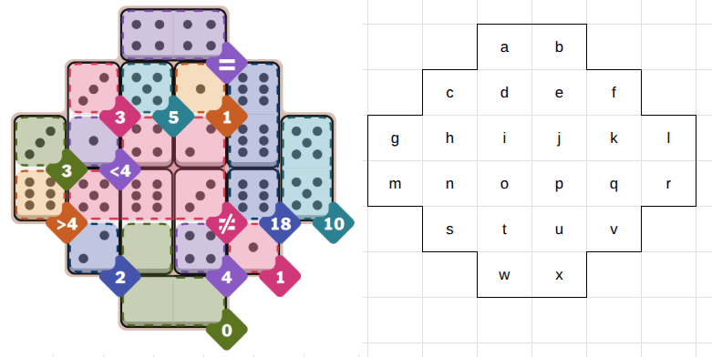

# Final remarks

Let's discuss the hard puzzle from September 21, 2005. 


We encode the puzzle as following:
```python
puzzle = {
    "dominoes": {
        (1, 2),
        (0, 6),
        (5, 5),
        (1, 3),
        (4, 4),
        (1, 6),
        (0, 0),
        (3, 4),
        (2, 5),
        (3, 6),
        (6, 6),
        (4, 5),
    },
    "constraints": [
        ConstraintEqual(["a", "b"]),
        ConstraintSum(["c"], 3),
        ConstraintSum(["d"], 5),
        ConstraintSum(["e"], 1),
        ConstraintSum(["f", "k", "q"], 18),
        ConstraintSum(["g"], 3),
        ConstraintLessThan(["h"], 4),
        ConstraintNotEqual(["i", "j", "n", "o", "p"]),
        ConstraintGreaterThan(["m"], 4),
        ConstraintSum(["l", "r"], 10),
        ConstraintSum(["s"], 2),
        ConstraintSum(["t", "w", "x"], 0),
        ConstraintSum(["u"], 4),
        ConstraintSum(["v"], 1),
    ],
    "links": {
        "a": ["b", "d"],
        "b": ["a", "e"],
        "c": ["d", "h"],
        "d": ["a", "c", "e", "i"],
        "e": ["b", "d", "f", "j"],
        "f": ["e", "k"],
        "g": ["h", "m"],
        "h": ["c", "g", "i", "n"],
        "i": ["d", "h", "j", "o"],
        "j": ["e", "i", "k", "p"],
        "k": ["f", "j", "l", "q"],
        "l": ["k", "r"],
        "m": ["g", "n"],
        "n": ["h", "m", "o", "s"],
        "o": ["i", "n", "p", "t"],
        "p": ["j", "o", "q", "u"],
        "q": ["k", "p", "r", "v"],
        "r": ["l", "q"],
        "s": ["n", "t"],
        "t": ["o", "s", "u", "w"],
        "u": ["p", "t", "v", "x"],
        "v": ["q", "u"],
        "w": ["t", "x"],
        "x": ["u", "w"],
    },
}
```
One can see that this puzzle has a much higher connectivity than the easy puzzle that was 
presented in the previous section.  There are 64 solutions for the *link* problem. 
We show below the first two and the last two solutions
```python
['(a-b)', '(c-d)', '(e-f)', '(g-h)', '(i-o)', '(j-p)', '(k-l)', '(m-n)', '(q-r)', '(s-t)', '(u-v)', '(w-x)']
['(a-b)', '(c-d)', '(e-f)', '(g-m)', '(h-n)', '(i-o)', '(j-p)', '(k-l)', '(q-r)', '(s-t)', '(u-v)', '(w-x)']
...
['(a-d)', '(b-e)', '(c-h)', '(f-k)', '(g-m)', '(i-j)', '(l-r)', '(n-o)', '(p-u)', '(q-v)', '(s-t)', '(w-x)']
['(a-d)', '(b-e)', '(c-h)', '(f-k)', '(g-m)', '(i-j)', '(l-r)', '(n-o)', '(p-q)', '(s-t)', '(u-v)', '(w-x)']
```

The stand alone *value* problem results in 360 solutions.  That is, we need to check at most 
`64 * 360 = 23,040` candidates in order to find the true solution.  This number is 
significantly smaller than the `1,961,990,553,600` candidates needed to be checked if we 
had used the brute force approach.  But then, who wants to be a brute these days?

In terms of execution time, with the current double SAT modelling, the puzzle is solved in `0.2` seconds, fast enough not be noticeable. You can check out the 
[code](https://github.com/thumbert/scales/blob/main/tests/or/pips.py) here for a complete implementation.  Happy puzzling!


